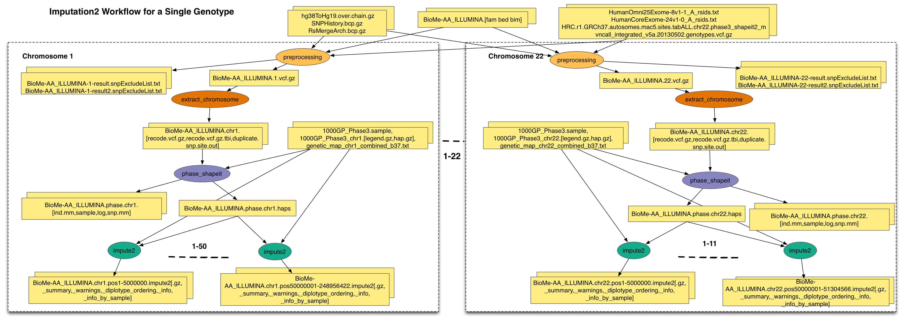

# page-imputation
Pegasus Imputation Workflows for PAGE2. PAGE II (Population Architecture using Genomics and Epidemiology) study has genotyped 50,000 samples using MEGA, an Illumina high density consortium-built array. The center is also imputing an additional 50,000 subjects genotyped in 20 different GWAS studies. Imputation is primarily done using SHAPEIT and IMPUTE2 with 1000 Genomes Project Reference Panel.

Imputation process  can be parallelized by chromosome to reduce total processing time. To do these imputation studies, a Pegasus imputation pipeline was developed. The production were done on Rutgers Uniersity Genetics Cluster called operon.

## Workflow

Here is an image of the DAX that does imputation for a single genotype/ GWAS study. . The workflow does processing per chromosome in parallel and  is agnostic  to array, strand, and build of the input data.

For each chromosome the following steps are applied

1. preprocess input data and make sure they are ready for imputation
  * to convert genome position from one build to another
  * to convert dbSNP rs number from one build to another
  * to rewrite plink \*.bim file when a SNP is monomorphic by comparing to 1000 Genome Project
  * to do a QC check before imputation

2. extract chromosomes
  * to filter out duplicate SNPs, INDELs
  * to extract a chromosome for imputation
  * to recode data into VCF format

3. phasing
  * implement SHAPEIT for haplotypes estimation (phasing)

4. imputation
  * implememt IMPUTE2 for genotype imputation

### Dependant Executables
The pipeline refers to a lot of other scripts and executables that need to be installed on your cluster. 

1. liftOver: https://genome-store.ucsc.edu [preprocessing]
  - to convert genome position from one build to another

2. LiftRsNumber.py: http://genome.sph.umich.edu/wiki/LiftOver#Lift_dbSNP_rs_numbers [preprocessing]
  - to convert dbSNP rs number from one build to another

3. HRC-check-bim.pl: http://www.well.ox.ac.uk/~wrayner/tools/ [preprocessing]
  - to do a QC check before imputation

4. more-alleles-2015-05-25.R [preprocessing]
  - to rewrite plink *.bim file when a SNP is monomorphic by comparing to 1KGP

5. extra-duplicate.pl [extract_chromosome]
  - to extract duplicate SNP positions from VCF

6.  vcftools: https://vcftools.github.io/index.html [extract_chromosome]
  - to remove INDELs and recode VCF files

7. phaseit : https://mathgen.stats.ox.ac.uk/genetics_software/shapeit/shapeit.html

8. impute2 : http://mathgen.stats.ox.ac.uk/impute/impute_v2.html

## How to set it up in cluster (use operon as an example)

1. make a directory called _PAGE\_imputation2\_input_ and copy your input datasets into this directory:
  ```bash
  mkdir ~/PAGE_imputation2_input
  ```

2. copy directory _/page-imputation_ to your desired location:
  ```bash
  cp -r /page-imputation/ ~/your/desired/path/.
  ```

3. copy all files in _/scripts_ to  _PAGE\_imputation2\_input_:  
  ```bash
  cp /page-imputation/scripts/* ~/PAGE_imputation2_input/.
  ```


4. go to directory _page-imputation_: 
  ```bash
  cd ~/your/desired/path/page-imputation/
  ```

5. run the followings: 
  ```bash
  ./generate_catalogs.sh

  ## from chromosome 1 to 22
  ## replace [study_name] with the name of your input dataset (without no extension)
  ## eg. if your input datasets are: page_test.bed, page_test.bim, page_test.fam
  ## then [study_name] is page_test
  ./imputation2.py --genotype-file [study_name] --chromosome-start 1 --chromosome-end 22 \
  -o imputation2-[study_name]-chr1-22.dax

  ## do pegasus plan
  pegasus-plan --conf conf/pegasusrc --dax imputation2-[study_name]-chr1-22.dax -s operon --dir dags \
  --input-dir ~/PAGE_imputation2_input/ --output-dir ./outputs/[study_name] --cleanup none --submit --force -v
  ```

6. to check workflow status: 
  ```bash
  pegasus-status /workflow/submit/directory
  ```
